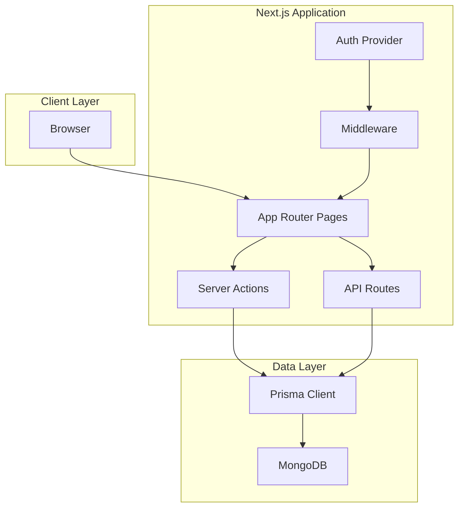
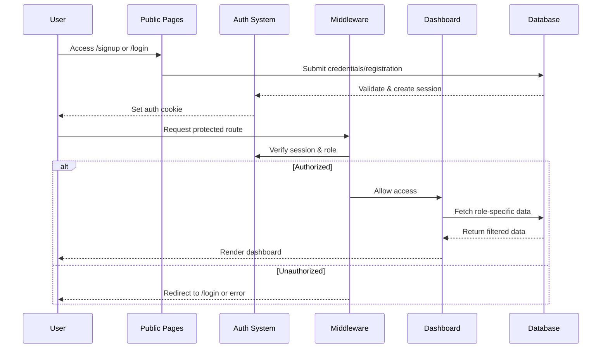

# Design Document: University Entrance Examination System

## Overview

The University Entrance Examination System is a monolithic Next.js application that manages the complete entrance examination workflow for RV University (RVU). The system implements role-based access control across three user types (Admin, Teacher, Student) and provides distinct workflows for student registration, admin approval, and teacher-specific student viewing.

### Key Authentication System Features (Updated)

**Auto-Generated Credentials System**:
- Students register WITHOUT providing a password
- System auto-generates unique username: `firstname + 3-digit random number` (e.g., "apoorva123", "rahul456")
- System auto-generates secure password: 8-10 characters with uppercase, lowercase, and numbers
- Generated credentials displayed once on registration success
- Email used for contact only, NOT for authentication

**First-Login Password Change**:
- All new users have `isFirstLogin = TRUE` flag
- Users redirected to `/change-password` on first login
- Must change auto-generated password before accessing dashboard
- After password change, `isFirstLogin` set to FALSE

**Username-Based Authentication**:
- Login uses username (NOT email)
- Error messages: "Invalid username or password"
- Admin user has hardcoded username "admin"

### Technology Stack

- **Frontend & Backend**: Next.js 16.2.3 (App Router)
- **Database**: SQLite
- **ORM**: Prisma
- **Authentication**: NextAuth.js v5 (Auth.js)
- **Password Hashing**: bcrypt
- **Language**: TypeScript
- **Styling**: Tailwind CSS v4

### Key Design Principles

1. **Simplicity First**: Single monolithic application with clear separation of concerns
2. **Role-Based Security**: Middleware-enforced access control at route level
3. **Type Safety**: Full TypeScript coverage with Prisma-generated types
4. **Data Integrity**: Immutable student selections after registration
5. **Efficient Queries**: Optimized database queries for teacher filtering
6. **Professional UI/UX**: Clean, modern interface with RV University branding

## Design System

### Color Palette (RV University Official)

#### Primary Colors (Brand)
- **Navy Blue**: `#1F3A68` - Main brand color (headers, sidebar, primary buttons)
- **Dark Navy**: `#162A4A` - Hover states, active items, pressed states

#### Accent Colors (RV Gold)
- **Gold**: `#F4B400` - Highlights, badges, important actions
- **Light Gold**: `#FFF3CD` - Badge backgrounds, subtle highlights

#### Backgrounds
- **Main Background**: `#F8F9FB` - Whole page background
- **Card Background**: `#FFFFFF` - All cards and containers
- **Sidebar Background**: `#1F3A68` - Navigation sidebar

#### Text Colors
- **Primary Text**: `#1A1A1A` - Main content text
- **Secondary Text**: `#6B7280` - Supporting text, labels
- **On Dark Background**: `#FFFFFF` - Text on navy backgrounds

#### Status Colors
- **Success**: `#22C55E` - Approved, success states
- **Warning**: `#F59E0B` - Pending, warnings
- **Error**: `#EF4444` - Rejected, errors
- **Info**: `#3B82F6` - Information, links

### Typography

#### Font Family
- **Primary**: 'Inter', system-ui, -apple-system, sans-serif
- **Fallback**: 'Poppins', system-ui, sans-serif

#### Font Sizes & Weights
- **Heading**: 28px / 1.75rem, font-weight: 700
- **Subheading**: 20px / 1.25rem, font-weight: 600
- **Body Large**: 16px / 1rem, font-weight: 400
- **Body**: 14px / 0.875rem, font-weight: 400
- **Caption**: 12px / 0.75rem, font-weight: 400

### Spacing System (8px base unit)

- **Small**: 8px / 0.5rem
- **Medium**: 16px / 1rem
- **Large**: 24px / 1.5rem
- **Section**: 32px / 2rem
- **Page**: 48px / 3rem

### Component Specifications

#### Buttons

**Primary Button (Navy)**
- Background: `#1F3A68`
- Text: `#FFFFFF`
- Padding: 12px 20px
- Border Radius: 8px
- Font: 14px, font-weight: 600
- Hover: Background `#162A4A`
- Shadow: 0 2px 4px rgba(0, 0, 0, 0.1)
- **RULE: NO faded buttons. NO low contrast. EVER.**

**Secondary Button (Outline)**
- Border: 1px solid `#1F3A68`
- Text: `#1F3A68`
- Background: transparent
- Padding: 12px 20px
- Border Radius: 8px
- Hover: Background `#F8F9FB`

**Accent Button (Important Actions)**
- Background: `#F4B400`
- Text: `#1A1A1A`
- Padding: 12px 20px
- Border Radius: 8px
- Font: 14px, font-weight: 600
- Hover: Background `#E5A020`

#### Cards (Use Everywhere)

- Background: `#FFFFFF`
- Border Radius: 12px
- Padding: 20px
- Shadow: 0 4px 12px rgba(0, 0, 0, 0.08)
- Hover: transform translateY(-2px), shadow 0 6px 16px rgba(0, 0, 0, 0.12)
- Transition: all 200ms ease

#### Sidebar (All Roles)

- Background: `#1F3A68`
- Text: `#FFFFFF`
- Width: 240px
- **Active Item**:
  - Background: `#162A4A`
  - Left Border: 4px solid `#F4B400`
- **Hover**: Slightly lighter navy (`#2A4A7C`)

#### Input Fields

- Border: 1px solid `#E5E7EB`
- Border Radius: 8px
- Padding: 12px 16px
- Font: 14px
- Focus: Border `#1F3A68`, ring 3px `rgba(31, 58, 104, 0.1)`
- Error: Border `#EF4444`

#### Badges

- Padding: 4px 12px
- Border Radius: 12px (fully rounded)
- Font: 12px, font-weight: 600
- **Success**: Background `#D1FAE5`, text `#065F46`
- **Warning**: Background `#FFF3CD`, text `#92400E`
- **Error**: Background `#FEE2E2`, text `#991B1B`
- **Info**: Background `#DBEAFE`, text `#1E40AF`

### Micro-Interactions

- **Button Hover**: Darker shade + slight shadow
- **Cards**: Slight lift on hover (translateY(-2px))
- **Inputs**: Blue border on focus
- **Sidebar**: Smooth transitions (200ms)
- **All Transitions**: 200ms ease

### Layout Specifications

#### Dashboard Structure
- **Sidebar**: 240px fixed width, navy background
- **Main Content**: Remaining width, `#F8F9FB` background
- **Content Padding**: 32px
- **Card Spacing**: 24px between cards

#### Grid System
- **Stats Cards**: 3-column grid on desktop, 1-column on mobile
- **Content Cards**: Full width with max-width 1200px
- **Gutter**: 24px

### Role-Specific Dashboard Designs

#### Student Dashboard
**Pages**: Programs, Exams, Results

**Top Section**:
- Welcome message with student name
- 3 stat cards: Programs Applied, Exams Scheduled, Results Available

**Programs Page**:
- Card-based layout (NOT text rows)
- Each card shows: Program name, School, Status badge, "View Details" button

**Exams Page**:
- Cards with: Exam name, Date, Duration, "Start Exam" button (Gold)

#### Teacher Dashboard
**Pages**: Assigned Subjects, Create Exam, Student Performance

**Dashboard Cards**:
- Exams Created
- Students Assigned
- Pending Evaluations

**Create Exam Page**:
- Form inside card
- Large inputs
- Clear labels
- Big "Create Exam" button (Navy)

#### Admin Dashboard
**Pages**: Manage Users, Assign Teachers, Monitor Exams

**Dashboard Overview**:
- Cards: Total Students, Total Teachers, Active Exams

**User Management**:
- Clean table with: Name, Role, Status, Action buttons

### Design Rules (STRICT)

❌ **REMOVE**:
- Flat layouts
- No cards
- Tiny buttons
- Random spacing
- Weak colors
- Low contrast buttons

✅ **USE**:
- Defined color palette
- Card-based layout everywhere
- Modern components
- Same design language across all roles
- Consistent spacing
- High contrast

## Architecture

### High-Level Architecture



### Application Flow



### Directory Structure

```
app/
├── (auth)/
│   ├── login/
│   │   └── page.tsx
│   ├── signup/
│   │   └── page.tsx
│   └── change-password/          # NEW: First-login password change
│       └── page.tsx
├── admin/
│   ├── dashboard/
│   │   └── page.tsx
│   └── users/                    # NEW: Optional user management
│       └── page.tsx
├── teacher/
│   └── dashboard/
│       └── page.tsx
├── student/
│   └── dashboard/
│       └── page.tsx
├── api/
│   ├── auth/
│   │   └── [...nextauth]/
│   │       └── route.ts
│   ├── register/
│   │   └── route.ts
│   ├── change-password/          # NEW: Password change endpoint
│   │   └── route.ts
│   ├── users/                    # NEW: Optional user list endpoint
│   │   └── route.ts
│   └── admin/
│       ├── approve/
│       │   └── route.ts
│       └── reset-password/       # NEW: Optional password reset
│           └── route.ts
├── layout.tsx
└── middleware.ts

lib/
├── auth.ts
├── prisma.ts
└── utils/
    ├── validation.ts
    ├── rbac.ts
    ├── username.ts               # NEW: Username generation utilities
    └── password.ts               # NEW: Password generation utilities

prisma/
└── schema.prisma

components/
├── auth/
│   ├── LoginForm.tsx
│   ├── SignupForm.tsx
│   ├── ChangePasswordForm.tsx    # NEW: Password change form
│   └── CredentialsModal.tsx      # NEW: Display generated credentials
├── admin/
│   ├── StudentApprovalTable.tsx
│   └── UserManagementTable.tsx   # NEW: Optional user management
├── teacher/
│   └── StudentListTable.tsx
└── student/
    └── SchoolProgramList.tsx
```

## Components and Interfaces

### Authentication Components

#### 1. LoginForm Component

**Purpose**: Handles user authentication for all roles using username/password

**Props**:
```typescript
interface LoginFormProps {
  callbackUrl?: string;
}
```

**Behavior**:
- Collects **username** and password (NOT email)
- Calls NextAuth signIn() with credentials provider
- Handles pending student status (displays "Waiting for admin approval")
- Handles first login redirect (redirects to /change-password if isFirstLogin is TRUE)
- Redirects based on role after successful authentication

#### 2. SignupForm Component

**Purpose**: Handles student registration with school/program selection and displays auto-generated credentials

**Props**:
```typescript
interface SignupFormProps {
  schools: School[];
}

interface School {
  id: string;
  name: string;
  programs: Program[];
}

interface Program {
  id: string;
  name: string;
  schoolId: string;
}
```

**State Management**:
```typescript
interface SignupFormState {
  name: string;
  email: string;
  phone: string;
  selectedSchools: Map<string, string[]>; // schoolId -> programIds[]
  showCredentialsModal: boolean;
  generatedCredentials?: {
    username: string;
    password: string;
  };
}
```

**Behavior**:
- Multi-select for schools (checkboxes)
- Dynamic program display based on selected schools
- Validates at least one school and one program selected
- **NO password input field** (password is auto-generated)
- Submits to /api/register endpoint
- On success, displays modal with generated username and password
- Modal includes "Copy Credentials" button and warning to save credentials
- After modal dismissal, redirects to login page

#### 3. ChangePasswordForm Component (NEW)

**Purpose**: Handles mandatory first-login password change

**Props**:
```typescript
interface ChangePasswordFormProps {
  userId: string;
}
```

**State Management**:
```typescript
interface ChangePasswordFormState {
  newPassword: string;
  confirmPassword: string;
  errors: {
    newPassword?: string;
    confirmPassword?: string;
    general?: string;
  };
}
```

**Behavior**:
- Displays two input fields: "New Password" and "Confirm Password"
- Validates password strength (minimum 8 characters)
- Validates that both passwords match
- Submits to /api/change-password endpoint
- On success, sets isFirstLogin to FALSE and redirects to role-specific dashboard
- Shows error messages for validation failures or API errors

### Admin Components

#### 3. StudentApprovalTable Component

**Purpose**: Displays pending students for admin approval/rejection

**Props**:
```typescript
interface StudentApprovalTableProps {
  students: PendingStudent[];
  onApprove: (studentId: string) => Promise<void>;
  onReject: (studentId: string) => Promise<void>;
}

interface PendingStudent {
  id: string;
  name: string;
  email: string;
  phone: string;
  selectedSchools: SelectedSchool[];
  createdAt: Date;
}

interface SelectedSchool {
  schoolName: string;
  programName: string;
}
```

**Behavior**:
- Displays all students with status "pending"
- Shows expandable view of selected schools/programs
- Approve button updates status to "approved"
- Reject button updates status to "rejected"
- Optimistic UI updates with error rollback

### Teacher Components

#### 4. StudentListTable Component

**Purpose**: Displays students who selected teacher's assigned school

**Props**:
```typescript
interface StudentListTableProps {
  students: TeacherStudent[];
  assignedSchool: string;
}

interface TeacherStudent {
  id: string;
  name: string;
  email: string;
  programForSchool: string; // Program selected for this teacher's school
  status: ApplicationStatus;
}
```

**Behavior**:
- Filters students by teacher's assigned school (server-side)
- Displays only the program relevant to teacher's school
- Read-only view (no actions)
- Sortable by name, email, status

### Student Components

#### 5. SchoolProgramList Component

**Purpose**: Displays student's selected schools and available exams

**Props**:
```typescript
interface SchoolProgramListProps {
  selectedSchools: SelectedSchool[];
  exams: Exam[];
}

interface Exam {
  id: string;
  schoolName: string;
  programName: string;
  date: Date;
  duration: number;
  status: 'upcoming' | 'completed';
}
```

**Behavior**:
- Groups exams by school
- Displays exam schedule
- Shows exam status (upcoming/completed)
- Future: Links to exam taking interface

### API Routes

#### POST /api/register

**Purpose**: Student registration endpoint with auto-generated credentials

**Request Body**:
```typescript
interface RegisterRequest {
  name: string;
  email: string;
  phone: string;
  selectedSchools: {
    schoolId: string;
    programIds: string[];
  }[];
}
```

**Response**:
```typescript
interface RegisterResponse {
  success: boolean;
  message: string;
  userId?: string;
  username: string;      // Auto-generated username
  password: string;      // Auto-generated password (plain text, only returned once)
}
```

**Logic**:
1. Validate input (email format, phone format)
2. Check email uniqueness
3. **Generate unique username**: `firstname + 3-digit random number` (e.g., "apoorva123")
   - Extract first name from full name
   - Generate random 3-digit number (100-999)
   - Check uniqueness in database
   - Retry with new random number if collision occurs (max 10 attempts)
4. **Generate secure password**: 8-10 characters with uppercase, lowercase, and numbers
   - Use crypto.randomBytes() for randomness
   - Ensure at least one uppercase, one lowercase, one number
5. Hash password with bcrypt (10 rounds)
6. Transform selectedSchools to JSON structure
7. Create user with role "student", status "pending", **isFirstLogin TRUE**
8. Return success response with **username and plain-text password**

**Utility Functions Required**:
```typescript
function generateUsername(fullName: string): Promise<string>;
function generateSecurePassword(): string;
function isUsernameUnique(username: string): Promise<boolean>;
```

#### POST /api/auth/[...nextauth]/route

**Purpose**: NextAuth.js authentication handler with username-based login

**Configuration**:
```typescript
export const authOptions: NextAuthOptions = {
  providers: [
    CredentialsProvider({
      name: 'Credentials',
      credentials: {
        username: { label: "Username", type: "text" },
        password: { label: "Password", type: "password" }
      },
      async authorize(credentials) {
        // 1. Find user by username (NOT email)
        const user = await prisma.user.findUnique({
          where: { username: credentials.username }
        });
        
        if (!user) {
          throw new Error('Invalid username or password');
        }
        
        // 2. Verify password with bcrypt
        const isValid = await bcrypt.compare(credentials.password, user.password);
        
        if (!isValid) {
          throw new Error('Invalid username or password');
        }
        
        // 3. Check if student with pending status
        if (user.role === 'STUDENT' && user.status === 'PENDING') {
          throw new Error('PENDING_APPROVAL');
        }
        
        if (user.role === 'STUDENT' && user.status === 'REJECTED') {
          throw new Error('APPLICATION_REJECTED');
        }
        
        // 4. Return user object with isFirstLogin flag
        return {
          id: user.id,
          name: user.name,
          email: user.email,
          username: user.username,
          role: user.role,
          status: user.status,
          isFirstLogin: user.isFirstLogin
        };
      }
    })
  ],
  callbacks: {
    async jwt({ token, user }) {
      if (user) {
        token.role = user.role;
        token.status = user.status;
        token.id = user.id;
        token.username = user.username;
        token.isFirstLogin = user.isFirstLogin;
      }
      return token;
    },
    async session({ session, token }) {
      session.user.role = token.role;
      session.user.status = token.status;
      session.user.id = token.id;
      session.user.username = token.username;
      session.user.isFirstLogin = token.isFirstLogin;
      return session;
    }
  },
  pages: {
    signIn: '/login',
  }
};
```

#### PATCH /api/admin/approve

**Purpose**: Admin approval/rejection of student applications

**Request Body**:
```typescript
interface ApproveRequest {
  studentId: string;
  action: 'approve' | 'reject';
}
```

**Response**:
```typescript
interface ApproveResponse {
  success: boolean;
  message: string;
}
```

**Logic**:
1. Verify requester is admin (from session)
2. Validate studentId exists and is a student
3. Update status to "approved" or "rejected"
4. Return success response

**Authorization**: Admin role required (checked in route handler)

#### GET /api/admin/students

**Purpose**: Fetch all pending students for admin dashboard

**Query Parameters**: None

**Response**:
```typescript
interface StudentsResponse {
  students: PendingStudent[];
}
```

**Logic**:
1. Verify requester is admin
2. Query users with role "student" and status "pending"
3. Return student list with selected schools/programs

#### GET /api/teacher/students

**Purpose**: Fetch students for teacher's assigned school

**Query Parameters**: None (teacher identified from session)

**Response**:
```typescript
interface TeacherStudentsResponse {
  students: TeacherStudent[];
  assignedSchool: string;
}
```

**Logic**:
1. Verify requester is teacher
2. Get teacher's assignedSchool from user record
3. Query students where selectedSchools contains assignedSchool
4. Extract only the program for teacher's school
5. Return filtered student list

#### GET /api/schools

**Purpose**: Fetch all schools and programs for registration form

**Query Parameters**: None

**Response**:
```typescript
interface SchoolsResponse {
  schools: School[];
}
```

**Logic**:
1. Query all schools with their programs
2. Return structured data for form rendering

#### POST /api/change-password (NEW)

**Purpose**: Handle first-login mandatory password change

**Request Body**:
```typescript
interface ChangePasswordRequest {
  newPassword: string;
  confirmPassword: string;
}
```

**Response**:
```typescript
interface ChangePasswordResponse {
  success: boolean;
  message: string;
}
```

**Logic**:
1. Verify user is authenticated (from session)
2. Verify user has isFirstLogin = TRUE
3. Validate newPassword and confirmPassword match
4. Validate password strength (minimum 8 characters)
5. Hash new password with bcrypt
6. Update user password in database
7. Set isFirstLogin = FALSE
8. Return success response

**Authorization**: Authenticated users with isFirstLogin = TRUE only

#### GET /api/users (NEW, Optional)

**Purpose**: Admin-only endpoint to view all users

**Query Parameters**: None

**Response**:
```typescript
interface UsersResponse {
  users: {
    id: string;
    name: string;
    username: string;
    role: Role;
    status: ApplicationStatus;
  }[];
}
```

**Logic**:
1. Verify requester is admin (from session)
2. Query all users, exclude password field
3. Return user list with Name, Username, Role, Status

**Authorization**: Admin role required

#### POST /api/admin/reset-password (NEW, Optional)

**Purpose**: Admin-only endpoint to reset user passwords

**Request Body**:
```typescript
interface ResetPasswordRequest {
  userId: string;
}
```

**Response**:
```typescript
interface ResetPasswordResponse {
  success: boolean;
  message: string;
  newPassword: string; // Auto-generated password (plain text, only returned once)
}
```

**Logic**:
1. Verify requester is admin (from session)
2. Validate userId exists
3. Generate new secure password using generateSecurePassword()
4. Hash password with bcrypt
5. Update user password in database
6. Set isFirstLogin = TRUE
7. Return success response with plain-text password

**Authorization**: Admin role required

### Middleware

#### middleware.ts

**Purpose**: Route-level authorization, authentication, and first-login redirect

**Protected Routes**:
- `/admin/*` - Admin only
- `/teacher/*` - Teacher only
- `/student/*` - Student only (approved status)
- `/change-password` - Authenticated users with isFirstLogin = TRUE only

**Logic**:
```typescript
export async function middleware(request: NextRequest) {
  const session = await getServerSession(authOptions);
  const path = request.nextUrl.pathname;

  // Public routes
  if (path === '/login' || path === '/signup') {
    return NextResponse.next();
  }

  // Require authentication for all other routes
  if (!session) {
    return NextResponse.redirect(new URL('/login', request.url));
  }

  // First login redirect - check if user needs to change password
  if (session.user.isFirstLogin && path !== '/change-password') {
    return NextResponse.redirect(new URL('/change-password', request.url));
  }

  // Prevent access to change-password if not first login
  if (path === '/change-password' && !session.user.isFirstLogin) {
    const dashboardPath = `/${session.user.role.toLowerCase()}/dashboard`;
    return NextResponse.redirect(new URL(dashboardPath, request.url));
  }

  // Role-based access control
  if (path.startsWith('/admin') && session.user.role !== 'admin') {
    return NextResponse.json(
      { error: 'Unauthorized' },
      { status: 403 }
    );
  }

  if (path.startsWith('/teacher') && session.user.role !== 'teacher') {
    return NextResponse.json(
      { error: 'Unauthorized' },
      { status: 403 }
    );
  }

  if (path.startsWith('/student')) {
    if (session.user.role !== 'student') {
      return NextResponse.json(
        { error: 'Unauthorized' },
        { status: 403 }
      );
    }
    if (session.user.status !== 'approved') {
      return NextResponse.redirect(new URL('/login', request.url));
    }
  }

  return NextResponse.next();
}

export const config = {
  matcher: ['/admin/:path*', '/teacher/:path*', '/student/:path*', '/change-password']
};
```

## Data Models

### Utility Functions (NEW)

The authentication system requires several utility functions for username and password generation:

#### Username Generation (`lib/utils/username.ts`)

```typescript
/**
 * Generates a unique username from a full name
 * Format: firstname + 3-digit random number (e.g., "apoorva123")
 * Retries on collision up to maxAttempts times
 */
export async function generateUsername(
  fullName: string, 
  maxAttempts: number = 10
): Promise<string> {
  const firstName = extractFirstName(fullName);
  
  for (let attempt = 0; attempt < maxAttempts; attempt++) {
    const randomNum = generateRandomThreeDigit();
    const username = `${firstName}${randomNum}`;
    
    if (await isUsernameUnique(username)) {
      return username;
    }
  }
  
  throw new Error('Unable to generate unique username after maximum attempts');
}

/**
 * Extracts the first name from a full name and converts to lowercase
 * Handles multiple spaces and special characters
 */
export function extractFirstName(fullName: string): string {
  return fullName.trim().split(/\s+/)[0].toLowerCase();
}

/**
 * Generates a random 3-digit number between 100 and 999
 */
export function generateRandomThreeDigit(): number {
  return Math.floor(Math.random() * 900) + 100;
}

/**
 * Checks if a username is unique in the database
 */
export async function isUsernameUnique(username: string): Promise<boolean> {
  const existingUser = await prisma.user.findUnique({
    where: { username }
  });
  return existingUser === null;
}
```

#### Password Generation (`lib/utils/password.ts`)

```typescript
import crypto from 'crypto';

/**
 * Generates a secure random password with 8-10 characters
 * Contains at least one uppercase letter, one lowercase letter, and one number
 */
export function generateSecurePassword(): string {
  const length = Math.floor(Math.random() * 3) + 8; // 8-10 characters
  
  const uppercase = 'ABCDEFGHIJKLMNOPQRSTUVWXYZ';
  const lowercase = 'abcdefghijklmnopqrstuvwxyz';
  const numbers = '0123456789';
  const allChars = uppercase + lowercase + numbers;
  
  let password = '';
  
  // Ensure at least one of each required character type
  password += uppercase[crypto.randomInt(0, uppercase.length)];
  password += lowercase[crypto.randomInt(0, lowercase.length)];
  password += numbers[crypto.randomInt(0, numbers.length)];
  
  // Fill remaining characters randomly
  for (let i = password.length; i < length; i++) {
    password += allChars[crypto.randomInt(0, allChars.length)];
  }
  
  // Shuffle the password to avoid predictable patterns
  return shuffleString(password);
}

/**
 * Shuffles a string randomly using Fisher-Yates algorithm
 */
function shuffleString(str: string): string {
  const arr = str.split('');
  for (let i = arr.length - 1; i > 0; i--) {
    const j = crypto.randomInt(0, i + 1);
    [arr[i], arr[j]] = [arr[j], arr[i]];
  }
  return arr.join('');
}

/**
 * Validates password strength for user-provided passwords
 * Minimum 8 characters
 */
export function isValidPassword(password: string): boolean {
  return password.length >= 8;
}
```

### Prisma Schema

```prisma
// prisma/schema.prisma

generator client {
  provider = "prisma-client-js"
}

datasource db {
  provider = "mongodb"
  url      = env("DATABASE_URL")
}

model User {
  id              String   @id @default(auto()) @map("_id") @db.ObjectId
  name            String
  email           String   @unique
  username        String   @unique  // NEW: Auto-generated username (firstname + 3-digit number)
  password        String   // bcrypt hashed
  phone           String
  role            Role
  status          ApplicationStatus @default(PENDING)
  isFirstLogin    Boolean  @default(true)  // NEW: Tracks if user must change password
  selectedSchools Json?    // For students: [{ schoolName: string, programName: string }]
  assignedSchool  String?  // For teachers: single school name
  createdAt       DateTime @default(now())
  updatedAt       DateTime @updatedAt

  @@index([email])
  @@index([username])  // NEW: Index for username-based login
  @@index([role, status])
}

enum Role {
  ADMIN
  TEACHER
  STUDENT
}

enum ApplicationStatus {
  PENDING
  APPROVED
  REJECTED
}

model School {
  id        String    @id @default(auto()) @map("_id") @db.ObjectId
  name      String    @unique
  programs  Program[]
  createdAt DateTime  @default(now())
}

model Program {
  id        String   @id @default(auto()) @map("_id") @db.ObjectId
  name      String
  schoolId  String   @db.ObjectId
  school    School   @relation(fields: [schoolId], references: [id])
  createdAt DateTime @default(now())

  @@unique([schoolId, name])
}
```

### Data Model Rationale

**User Model**:
- **Single table for all roles**: Simplifies authentication and reduces joins
- **username field (NEW)**: Unique identifier for login, auto-generated as firstname + 3-digit random number
- **isFirstLogin field (NEW)**: Boolean flag to enforce mandatory password change on first login
- **email field**: Used for contact purposes only, NOT for authentication
- **selectedSchools as JSON**: Flexible structure for multiple school/program pairs, immutable after registration
- **assignedSchool as String**: Simple reference to school name for teachers
- **status field**: Controls student access to dashboard
- **Indexes**: Optimized for login queries (username), email lookups, and dashboard queries (role + status)

**School and Program Models**:
- **Separate tables**: Normalized structure for data integrity
- **Relation**: One-to-many (School -> Programs)
- **Unique constraint**: Prevents duplicate program names within a school

### Selected Schools JSON Structure

For students, the `selectedSchools` field stores:

```json
[
  {
    "schoolName": "School of Computer Science & Engineering",
    "programName": "B.Tech CSE"
  },
  {
    "schoolName": "School of Business",
    "programName": "BBA"
  }
]
```

**Design Decision**: Using JSON instead of a junction table because:
1. Student selections are immutable after registration (Requirement 10.4)
2. No need for complex queries on individual selections
3. Simpler data model and fewer database queries
4. Denormalized school/program names prevent issues if school data changes

### Database Seeding

Initial data for 9 schools and their programs:

```typescript
// prisma/seed.ts

const schools = [
  {
    name: "School of Computer Science & Engineering",
    programs: ["B.Tech CSE", "M.Tech CSE", "PhD CSE"]
  },
  {
    name: "School of Electronics & Communication",
    programs: ["B.Tech ECE", "M.Tech ECE"]
  },
  {
    name: "School of Business",
    programs: ["BBA", "MBA"]
  },
  {
    name: "School of Architecture",
    programs: ["B.Arch", "M.Arch"]
  },
  {
    name: "School of Liberal Arts",
    programs: ["BA English", "BA Psychology", "MA English"]
  },
  {
    name: "School of Law",
    programs: ["BA LLB", "BBA LLB", "LLM"]
  },
  {
    name: "School of Design",
    programs: ["B.Des", "M.Des"]
  },
  {
    name: "School of Sciences",
    programs: ["B.Sc Physics", "B.Sc Chemistry", "M.Sc Physics"]
  },
  {
    name: "School of Civil Engineering",
    programs: ["B.Tech Civil", "M.Tech Civil"]
  }
];

// Seed admin user with username "admin"
const admin = {
  name: "System Admin",
  email: "admin@rvu.edu.in",
  username: "admin",                              // MUST be "admin"
  password: await bcrypt.hash("admin123", 10),
  phone: "9876543210",
  role: "ADMIN",
  status: "APPROVED",
  isFirstLogin: false                             // Admin doesn't need to change password
};

// Seed 2 teachers per school (18 total)
// Each teacher must have:
// - Auto-generated username (firstname + 3-digit number)
// - Auto-generated password
// - isFirstLogin: true
// - assignedSchool: one of the 9 schools
```

**Username Generation for Seeding**:
- Admin: username = "admin" (hardcoded)
- Teachers: Use generateUsername() utility to create unique usernames
- Students: Generated during registration via /api/register

## Error Handling

### Error Categories

#### 1. Authentication Errors

**Scenarios**:
- Invalid credentials (wrong username or password)
- Pending student attempting login
- Rejected student attempting login
- Session expiration
- First login not completed

**Handling**:
```typescript
// In authorize callback
if (!user) {
  throw new Error('Invalid username or password');  // Changed from "Invalid email or password"
}

if (user.role === 'STUDENT' && user.status === 'PENDING') {
  throw new Error('PENDING_APPROVAL'); // Special error code
}

if (user.role === 'STUDENT' && user.status === 'REJECTED') {
  throw new Error('APPLICATION_REJECTED');
}

// First login redirect handled in middleware
```

**User Feedback**:
- "Invalid username or password" for failed authentication (changed from email)
- "Waiting for admin approval" for pending students
- "Your application has been rejected" for rejected students
- Automatic redirect to /change-password for first login

#### 2. Authorization Errors

**Scenarios**:
- User accessing route for different role
- Unauthenticated user accessing protected route

**Handling**:
- Middleware returns 403 Forbidden with JSON error
- Client displays error message or redirects to login

**User Feedback**:
- "You do not have permission to access this page"
- Redirect to appropriate dashboard

#### 3. Validation Errors

**Scenarios**:
- Invalid email format
- Invalid phone number
- No schools/programs selected
- Duplicate email registration
- Duplicate username (during generation)
- Password mismatch (during password change)
- Weak password (during password change)

**Handling**:
```typescript
// In /api/register
const errors: string[] = [];

if (!isValidEmail(email)) {
  errors.push('Invalid email format');
}

// NO password validation during registration (auto-generated)

if (selectedSchools.length === 0) {
  errors.push('Select at least one school and program');
}

if (errors.length > 0) {
  return NextResponse.json(
    { success: false, errors },
    { status: 400 }
  );
}

// Username collision handling
let username = await generateUsername(name);
let attempts = 0;
while (!(await isUsernameUnique(username)) && attempts < 10) {
  username = await generateUsername(name);
  attempts++;
}

if (attempts >= 10) {
  return NextResponse.json(
    { success: false, message: 'Unable to generate unique username. Please try again.' },
    { status: 500 }
  );
}

// In /api/change-password
if (newPassword !== confirmPassword) {
  return NextResponse.json(
    { success: false, message: 'Passwords do not match' },
    { status: 400 }
  );
}

if (newPassword.length < 8) {
  return NextResponse.json(
    { success: false, message: 'Password must be at least 8 characters' },
    { status: 400 }
  );
}
```

**User Feedback**:
- Display validation errors inline on form fields
- Prevent form submission until errors resolved
- "Passwords do not match" for password change mismatch
- "Password must be at least 8 characters" for weak passwords

#### 4. Database Errors

**Scenarios**:
- Connection failure
- Unique constraint violation (duplicate email)
- Query timeout

**Handling**:
```typescript
try {
  await prisma.user.create({ data: userData });
} catch (error) {
  if (error.code === 'P2002') {
    // Unique constraint violation
    return NextResponse.json(
      { success: false, message: 'Email already registered' },
      { status: 409 }
    );
  }
  
  console.error('Database error:', error);
  return NextResponse.json(
    { success: false, message: 'Internal server error' },
    { status: 500 }
  );
}
```

**User Feedback**:
- "Email already registered. Please login or use a different email."
- "Something went wrong. Please try again later." (for unexpected errors)

#### 5. Data Integrity Errors

**Scenarios**:
- Attempting to modify selectedSchools after registration
- Invalid school/program combinations
- Teacher assigned to non-existent school

**Handling**:
- Prevent modification at API level (return 403)
- Validate school/program existence before saving
- Validate assignedSchool exists in School table

**User Feedback**:
- "Cannot modify school selections after registration"
- "Invalid school or program selected"

### Error Logging

**Strategy**:
- Log all errors to console in development
- Use structured logging service (e.g., Sentry, LogRocket) in production
- Include context: user ID, role, action attempted, timestamp

**Example**:
```typescript
logger.error('Student approval failed', {
  adminId: session.user.id,
  studentId: request.studentId,
  action: request.action,
  error: error.message,
  timestamp: new Date().toISOString()
});
```

## Testing Strategy

### Overview

This system is **not suitable for property-based testing** because:
1. **UI-centric**: Primarily involves rendering, navigation, and user interactions
2. **CRUD operations**: Database persistence with no complex transformation logic
3. **Authentication flows**: Session management and role-based access control
4. **External dependencies**: Database, authentication provider, session storage

**Testing Approach**: Combination of unit tests, integration tests, and end-to-end tests using example-based testing.

### Unit Tests

**Focus**: Individual functions and components with mocked dependencies

**Tools**: Jest + React Testing Library

**Coverage**:

1. **Validation Functions** (`lib/utils/validation.ts`)
   - Email format validation
   - Phone number format validation
   - School/program selection validation
   - Password strength validation (for password change)

2. **Username Generation** (`lib/utils/username.ts`) **NEW**
   - Generate username from full name
   - Extract first name correctly
   - Generate 3-digit random number
   - Check username uniqueness
   - Retry on collision

3. **Password Generation** (`lib/utils/password.ts`) **NEW**
   - Generate secure random password (8-10 characters)
   - Ensure at least one uppercase letter
   - Ensure at least one lowercase letter
   - Ensure at least one number
   - Verify password complexity

4. **RBAC Utilities** (`lib/utils/rbac.ts`)
   - Role checking functions
   - Permission validation
   - Route access determination

5. **Component Logic**
   - SignupForm: School selection state management, credentials modal display
   - ChangePasswordForm: Password validation, match checking **NEW**
   - StudentApprovalTable: Optimistic UI updates
   - StudentListTable: Filtering logic

**Example Tests**:
```typescript
describe('Validation', () => {
  test('validates email format', () => {
    expect(isValidEmail('user@example.com')).toBe(true);
    expect(isValidEmail('invalid-email')).toBe(false);
  });

  test('validates password strength for change', () => {
    expect(isValidPassword('short')).toBe(false);
    expect(isValidPassword('validpassword123')).toBe(true);
  });
});

describe('Username Generation', () => {
  test('generates username from full name', () => {
    const username = generateUsernameSync('Apoorva Kumar');
    expect(username).toMatch(/^apoorva\d{3}$/);
  });

  test('extracts first name correctly', () => {
    expect(extractFirstName('John Doe')).toBe('john');
    expect(extractFirstName('Mary Jane Watson')).toBe('mary');
  });

  test('generates 3-digit random number', () => {
    const num = generateRandomThreeDigit();
    expect(num).toBeGreaterThanOrEqual(100);
    expect(num).toBeLessThanOrEqual(999);
  });
});

describe('Password Generation', () => {
  test('generates password with correct length', () => {
    const password = generateSecurePassword();
    expect(password.length).toBeGreaterThanOrEqual(8);
    expect(password.length).toBeLessThanOrEqual(10);
  });

  test('generates password with required character types', () => {
    const password = generateSecurePassword();
    expect(password).toMatch(/[A-Z]/); // At least one uppercase
    expect(password).toMatch(/[a-z]/); // At least one lowercase
    expect(password).toMatch(/[0-9]/); // At least one number
  });

  test('generates unique passwords', () => {
    const passwords = new Set();
    for (let i = 0; i < 100; i++) {
      passwords.add(generateSecurePassword());
    }
    expect(passwords.size).toBeGreaterThan(95); // High uniqueness
  });
});

describe('SignupForm', () => {
  test('displays programs for selected schools', () => {
    render(<SignupForm schools={mockSchools} />);
    fireEvent.click(screen.getByLabelText('School of CSE'));
    expect(screen.getByText('B.Tech CSE')).toBeInTheDocument();
  });

  test('prevents submission without selections', () => {
    render(<SignupForm schools={mockSchools} />);
    fireEvent.click(screen.getByText('Register'));
    expect(screen.getByText('Select at least one school')).toBeInTheDocument();
  });

  test('displays credentials modal on successful registration', async () => {
    render(<SignupForm schools={mockSchools} />);
    // Fill form and submit
    // Mock successful API response with username and password
    await waitFor(() => {
      expect(screen.getByText(/Your login credentials/i)).toBeInTheDocument();
      expect(screen.getByText(/Username:/i)).toBeInTheDocument();
      expect(screen.getByText(/Password:/i)).toBeInTheDocument();
    });
  });
});

describe('ChangePasswordForm', () => {
  test('validates password match', () => {
    render(<ChangePasswordForm userId="123" />);
    fireEvent.change(screen.getByLabelText('New Password'), { target: { value: 'password123' } });
    fireEvent.change(screen.getByLabelText('Confirm Password'), { target: { value: 'different' } });
    fireEvent.click(screen.getByText('Change Password'));
    expect(screen.getByText('Passwords do not match')).toBeInTheDocument();
  });

  test('validates password strength', () => {
    render(<ChangePasswordForm userId="123" />);
    fireEvent.change(screen.getByLabelText('New Password'), { target: { value: 'short' } });
    fireEvent.change(screen.getByLabelText('Confirm Password'), { target: { value: 'short' } });
    fireEvent.click(screen.getByText('Change Password'));
    expect(screen.getByText(/at least 8 characters/i)).toBeInTheDocument();
  });
});
```

### Integration Tests

**Focus**: API routes and database interactions

**Tools**: Jest + Supertest + MongoDB Memory Server

**Coverage**:

1. **Registration Flow**
   - POST /api/register with valid data creates user
   - Username is auto-generated in correct format (firstname + 3-digit number)
   - Password is auto-generated with correct complexity
   - Response includes username and password
   - Duplicate email returns 409 error
   - Invalid data returns 400 with validation errors
   - Password is hashed before storage
   - isFirstLogin is set to TRUE

2. **Authentication Flow**
   - Valid username and password return session
   - Invalid credentials return error with "Invalid username or password" message
   - Pending student cannot access dashboard
   - Approved student with isFirstLogin TRUE redirects to /change-password
   - Approved student with isFirstLogin FALSE can access dashboard
   - Session includes isFirstLogin flag

3. **Password Change Flow** **NEW**
   - POST /api/change-password with matching passwords succeeds
   - Password mismatch returns 400 error
   - Weak password returns 400 error
   - Successful change sets isFirstLogin to FALSE
   - Unauthenticated request returns 401
   - User with isFirstLogin FALSE cannot change password via this endpoint

4. **Admin Approval Flow**
   - Admin can approve pending students
   - Admin can reject pending students
   - Non-admin cannot access approval endpoint
   - Status updates persist to database

5. **Teacher Filtering**
   - Teacher sees only students for assigned school
   - Teacher sees correct program for their school
   - Teacher cannot see students from other schools

6. **Username Uniqueness** **NEW**
   - Username generation retries on collision
   - Maximum retry attempts prevent infinite loops
   - Unique usernames are generated for concurrent registrations

**Example Tests**:
```typescript
describe('POST /api/register', () => {
  test('creates student with auto-generated credentials', async () => {
    const response = await request(app)
      .post('/api/register')
      .send({
        name: 'John Doe',
        email: 'john@example.com',
        phone: '9876543210',
        selectedSchools: [
          { schoolId: 'school1', programIds: ['prog1'] }
        ]
      });

    expect(response.status).toBe(201);
    expect(response.body.success).toBe(true);
    expect(response.body.username).toMatch(/^john\d{3}$/);
    expect(response.body.password).toHaveLength(expect.any(Number));
    expect(response.body.password.length).toBeGreaterThanOrEqual(8);
    expect(response.body.password.length).toBeLessThanOrEqual(10);

    const user = await prisma.user.findUnique({
      where: { email: 'john@example.com' }
    });

    expect(user.status).toBe('PENDING');
    expect(user.role).toBe('STUDENT');
    expect(user.isFirstLogin).toBe(true);
    expect(user.username).toBe(response.body.username);
    // Verify password is hashed
    expect(user.password).not.toBe(response.body.password);
  });

  test('rejects duplicate email', async () => {
    await createUser({ email: 'existing@example.com' });

    const response = await request(app)
      .post('/api/register')
      .send({
        name: 'Jane Doe',
        email: 'existing@example.com',
        phone: '9876543210',
        selectedSchools: [
          { schoolId: 'school1', programIds: ['prog1'] }
        ]
      });

    expect(response.status).toBe(409);
    expect(response.body.message).toContain('already registered');
  });

  test('generates unique usernames for same first name', async () => {
    const response1 = await request(app)
      .post('/api/register')
      .send({
        name: 'John Doe',
        email: 'john1@example.com',
        phone: '9876543210',
        selectedSchools: [{ schoolId: 'school1', programIds: ['prog1'] }]
      });

    const response2 = await request(app)
      .post('/api/register')
      .send({
        name: 'John Smith',
        email: 'john2@example.com',
        phone: '9876543211',
        selectedSchools: [{ schoolId: 'school1', programIds: ['prog1'] }]
      });

    expect(response1.body.username).not.toBe(response2.body.username);
    expect(response1.body.username).toMatch(/^john\d{3}$/);
    expect(response2.body.username).toMatch(/^john\d{3}$/);
  });
});

describe('POST /api/auth/[...nextauth]', () => {
  test('authenticates with username and password', async () => {
    const user = await createUser({
      username: 'testuser123',
      password: await bcrypt.hash('password123', 10)
    });

    const response = await request(app)
      .post('/api/auth/callback/credentials')
      .send({
        username: 'testuser123',
        password: 'password123'
      });

    expect(response.status).toBe(200);
    expect(response.body.user.username).toBe('testuser123');
  });

  test('rejects invalid username', async () => {
    const response = await request(app)
      .post('/api/auth/callback/credentials')
      .send({
        username: 'nonexistent',
        password: 'password123'
      });

    expect(response.status).toBe(401);
    expect(response.body.error).toContain('Invalid username or password');
  });
});

describe('POST /api/change-password', () => {
  test('changes password successfully', async () => {
    const user = await createUser({
      isFirstLogin: true,
      password: await bcrypt.hash('oldpassword', 10)
    });

    const response = await request(app)
      .post('/api/change-password')
      .set('Cookie', await getAuthCookie(user))
      .send({
        newPassword: 'newpassword123',
        confirmPassword: 'newpassword123'
      });

    expect(response.status).toBe(200);
    expect(response.body.success).toBe(true);

    const updatedUser = await prisma.user.findUnique({
      where: { id: user.id }
    });

    expect(updatedUser.isFirstLogin).toBe(false);
    const isValid = await bcrypt.compare('newpassword123', updatedUser.password);
    expect(isValid).toBe(true);
  });

  test('rejects mismatched passwords', async () => {
    const user = await createUser({ isFirstLogin: true });

    const response = await request(app)
      .post('/api/change-password')
      .set('Cookie', await getAuthCookie(user))
      .send({
        newPassword: 'password123',
        confirmPassword: 'different456'
      });

    expect(response.status).toBe(400);
    expect(response.body.message).toContain('do not match');
  });

  test('rejects weak password', async () => {
    const user = await createUser({ isFirstLogin: true });

    const response = await request(app)
      .post('/api/change-password')
      .set('Cookie', await getAuthCookie(user))
      .send({
        newPassword: 'short',
        confirmPassword: 'short'
      });

    expect(response.status).toBe(400);
    expect(response.body.message).toContain('at least 8 characters');
  });
});

describe('GET /api/teacher/students', () => {
  test('returns only students for teacher school', async () => {
    const teacher = await createTeacher({
      assignedSchool: 'School of CSE'
    });

    await createStudent({
      selectedSchools: [
        { schoolName: 'School of CSE', programName: 'B.Tech CSE' }
      ]
    });

    await createStudent({
      selectedSchools: [
        { schoolName: 'School of Business', programName: 'BBA' }
      ]
    });

    const response = await request(app)
      .get('/api/teacher/students')
      .set('Cookie', await getAuthCookie(teacher));

    expect(response.status).toBe(200);
    expect(response.body.students).toHaveLength(1);
    expect(response.body.students[0].programForSchool).toBe('B.Tech CSE');
  });
});
```

### End-to-End Tests

**Focus**: Complete user workflows across the application

**Tools**: Playwright or Cypress

**Coverage**:

1. **Student Registration and Approval Workflow**
   - Student registers with multiple schools (no password input)
   - System displays auto-generated username and password
   - Student attempts login with generated credentials (sees pending message)
   - Admin logs in and approves student
   - Student logs in successfully and is redirected to /change-password
   - Student changes password
   - Student accesses dashboard after password change

2. **First Login Password Change Flow** **NEW**
   - User with isFirstLogin TRUE is redirected to /change-password
   - User cannot access dashboard until password is changed
   - Password change form validates password match
   - Password change form validates password strength
   - After successful password change, user is redirected to dashboard
   - User with isFirstLogin FALSE cannot access /change-password

3. **Role-Based Access Control**
   - Student cannot access admin/teacher routes
   - Teacher cannot access admin/student routes
   - Admin cannot access teacher/student routes

4. **Teacher Student Viewing**
   - Teacher logs in
   - Sees only students for assigned school
   - Sees correct program information

5. **Username-Based Authentication** **NEW**
   - Login form uses username field (not email)
   - Error messages say "Invalid username or password"
   - Admin user can login with username "admin"

**Example Tests**:
```typescript
test('complete student registration and approval flow with password change', async ({ page }) => {
  // Student registration (no password field)
  await page.goto('/signup');
  await page.fill('[name="name"]', 'Test Student');
  await page.fill('[name="email"]', 'student@test.com');
  await page.fill('[name="phone"]', '9876543210');
  await page.check('[value="school-cse"]');
  await page.check('[value="program-btech-cse"]');
  await page.click('button[type="submit"]');

  // Credentials modal appears
  await expect(page.locator('text=Your login credentials')).toBeVisible();
  const username = await page.locator('[data-testid="generated-username"]').textContent();
  const password = await page.locator('[data-testid="generated-password"]').textContent();

  // Copy credentials and close modal
  await page.click('button:has-text("Copy Credentials")');
  await page.click('button:has-text("Continue to Login")');

  await expect(page).toHaveURL('/login');

  // Student login attempt (pending)
  await page.fill('[name="username"]', username);  // Changed from email
  await page.fill('[name="password"]', password);
  await page.click('button[type="submit"]');

  await expect(page.locator('text=Waiting for admin approval')).toBeVisible();

  // Admin approval
  await page.goto('/login');
  await page.fill('[name="username"]', 'admin');  // Changed from email
  await page.fill('[name="password"]', 'admin123');
  await page.click('button[type="submit"]');

  await expect(page).toHaveURL('/admin/dashboard');

  await page.click(`button:has-text("Approve"):near(:text("${username}"))`);
  await expect(page.locator('text=Student approved')).toBeVisible();

  // Student login success - redirected to change password
  await page.goto('/login');
  await page.fill('[name="username"]', username);
  await page.fill('[name="password"]', password);
  await page.click('button[type="submit"]');

  await expect(page).toHaveURL('/change-password');

  // Change password
  await page.fill('[name="newPassword"]', 'mynewpassword123');
  await page.fill('[name="confirmPassword"]', 'mynewpassword123');
  await page.click('button[type="submit"]');

  // Redirected to dashboard
  await expect(page).toHaveURL('/student/dashboard');
  await expect(page.locator('text=School of Computer Science')).toBeVisible();

  // Verify cannot access change-password again
  await page.goto('/change-password');
  await expect(page).toHaveURL('/student/dashboard');
});

test('first login redirect enforced', async ({ page }) => {
  // Create approved user with isFirstLogin = true
  const user = await createApprovedStudent({ isFirstLogin: true });

  // Login
  await page.goto('/login');
  await page.fill('[name="username"]', user.username);
  await page.fill('[name="password"]', 'temppassword');
  await page.click('button[type="submit"]');

  // Should be redirected to change-password
  await expect(page).toHaveURL('/change-password');

  // Try to access dashboard directly
  await page.goto('/student/dashboard');
  
  // Should be redirected back to change-password
  await expect(page).toHaveURL('/change-password');
});

test('username-based login', async ({ page }) => {
  await page.goto('/login');

  // Verify username field exists (not email)
  await expect(page.locator('label:has-text("Username")')).toBeVisible();
  await expect(page.locator('[name="username"]')).toBeVisible();

  // Test invalid username
  await page.fill('[name="username"]', 'nonexistent');
  await page.fill('[name="password"]', 'password123');
  await page.click('button[type="submit"]');

  await expect(page.locator('text=Invalid username or password')).toBeVisible();
});
```

### Test Data Management

**Strategy**:
- Use MongoDB Memory Server for integration tests (isolated, fast)
- Use test database for E2E tests (reset before each test suite)
- Seed consistent test data (schools, programs, admin user)
- Factory functions for creating test users

**Example Factory**:
```typescript
async function createStudent(overrides = {}) {
  return await prisma.user.create({
    data: {
      name: 'Test Student',
      email: `student-${Date.now()}@test.com`,
      password: await bcrypt.hash('password123', 10),
      phone: '9876543210',
      role: 'STUDENT',
      status: 'PENDING',
      selectedSchools: [
        { schoolName: 'School of CSE', programName: 'B.Tech CSE' }
      ],
      ...overrides
    }
  });
}
```

### Testing Priorities

**High Priority** (Must have before production):
1. Authentication and authorization flows with username-based login
2. Student registration with auto-generated credentials
3. First-login mandatory password change flow
4. Username generation with collision handling
5. Secure password generation
6. Admin approval/rejection
7. Teacher filtering by assigned school
8. Role-based route protection with first-login redirect

**Medium Priority** (Important for reliability):
1. Validation error handling (password match, strength)
2. Database error handling (username collision)
3. Session management with isFirstLogin flag
4. Data integrity constraints
5. Credentials modal display and copy functionality

**Low Priority** (Nice to have):
1. UI component styling
2. Loading states
3. Optimistic UI updates
4. Error message wording
5. Admin password reset functionality
6. User management page

### Continuous Integration

**CI Pipeline**:
1. Run unit tests on every commit
2. Run integration tests on every PR
3. Run E2E tests before merging to main
4. Enforce 80% code coverage for business logic
5. Block merge if tests fail

**Tools**: GitHub Actions, CircleCI, or GitLab CI

