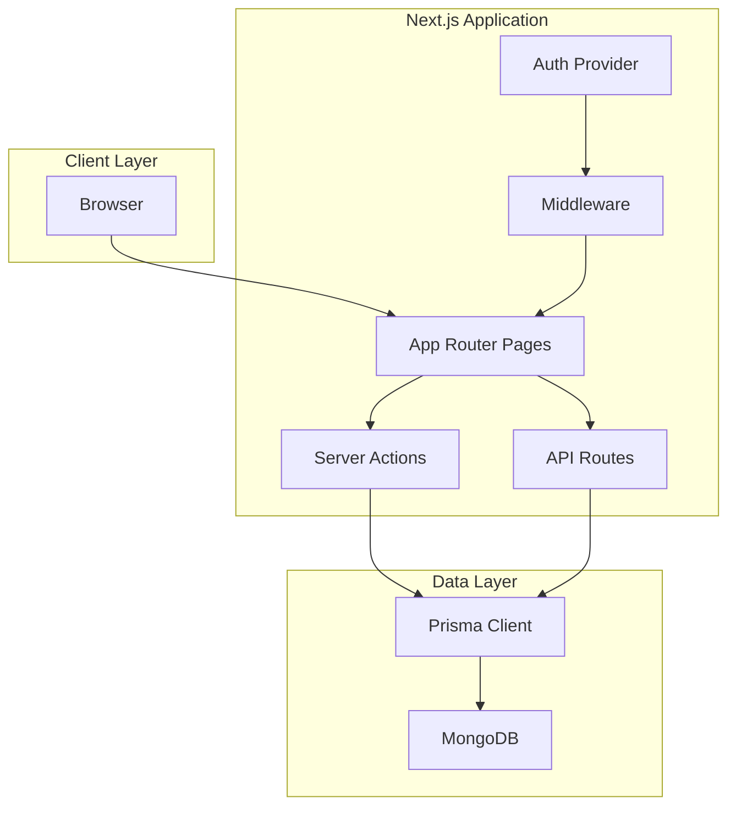
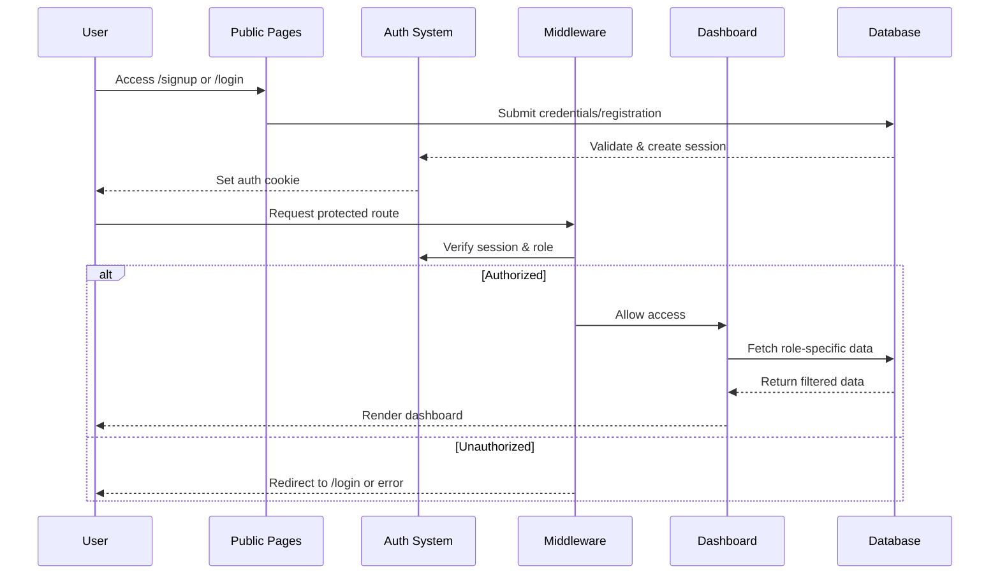

# Design Document: University Entrance Examination System

## Overview

The University Entrance Examination System is a monolithic Next.js application that manages the complete entrance examination workflow for RV University (RVU). The system implements role-based access control across three user types (Admin, Teacher, Student) and provides distinct workflows for student registration, admin approval, and teacher-specific student viewing.

### Technology Stack

- **Frontend & Backend**: Next.js 14+ (App Router)
- **Database**: MongoDB
- **ORM**: Prisma
- **Authentication**: NextAuth.js v5 (Auth.js)
- **Password Hashing**: bcrypt
- **Language**: TypeScript
- **Styling**: Tailwind CSS (recommended for rapid development)

### Key Design Principles

1. **Simplicity First**: Single monolithic application with clear separation of concerns
2. **Role-Based Security**: Middleware-enforced access control at route level
3. **Type Safety**: Full TypeScript coverage with Prisma-generated types
4. **Data Integrity**: Immutable student selections after registration
5. **Efficient Queries**: Optimized database queries for teacher filtering

## Architecture

### High-Level Architecture



### Application Flow



### Directory Structure

```
app/
├── (auth)/
│   ├── login/
│   │   └── page.tsx
│   └── signup/
│       └── page.tsx
├── admin/
│   └── dashboard/
│       └── page.tsx
├── teacher/
│   └── dashboard/
│       └── page.tsx
├── student/
│   └── dashboard/
│       └── page.tsx
├── api/
│   ├── auth/
│   │   └── [...nextauth]/
│   │       └── route.ts
│   ├── register/
│   │   └── route.ts
│   └── admin/
│       └── approve/
│           └── route.ts
├── layout.tsx
└── middleware.ts

lib/
├── auth.ts
├── prisma.ts
└── utils/
    ├── validation.ts
    └── rbac.ts

prisma/
└── schema.prisma

components/
├── auth/
│   ├── LoginForm.tsx
│   └── SignupForm.tsx
├── admin/
│   └── StudentApprovalTable.tsx
├── teacher/
│   └── StudentListTable.tsx
└── student/
    └── SchoolProgramList.tsx
```

## Components and Interfaces

### Authentication Components

#### 1. LoginForm Component

**Purpose**: Handles user authentication for all roles

**Props**:
```typescript
interface LoginFormProps {
  callbackUrl?: string;
}
```

**Behavior**:
- Collects email and password
- Calls NextAuth signIn() with credentials provider
- Handles pending student status (displays "Waiting for admin approval")
- Redirects based on role after successful authentication

#### 2. SignupForm Component

**Purpose**: Handles student registration with school/program selection

**Props**:
```typescript
interface SignupFormProps {
  schools: School[];
}

interface School {
  id: string;
  name: string;
  programs: Program[];
}

interface Program {
  id: string;
  name: string;
  schoolId: string;
}
```

**State Management**:
```typescript
interface SignupFormState {
  name: string;
  email: string;
  password: string;
  phone: string;
  selectedSchools: Map<string, string[]>; // schoolId -> programIds[]
}
```

**Behavior**:
- Multi-select for schools (checkboxes)
- Dynamic program display based on selected schools
- Validates at least one school and one program selected
- Submits to /api/register endpoint
- Redirects to login with success message

### Admin Components

#### 3. StudentApprovalTable Component

**Purpose**: Displays pending students for admin approval/rejection

**Props**:
```typescript
interface StudentApprovalTableProps {
  students: PendingStudent[];
  onApprove: (studentId: string) => Promise<void>;
  onReject: (studentId: string) => Promise<void>;
}

interface PendingStudent {
  id: string;
  name: string;
  email: string;
  phone: string;
  selectedSchools: SelectedSchool[];
  createdAt: Date;
}

interface SelectedSchool {
  schoolName: string;
  programName: string;
}
```

**Behavior**:
- Displays all students with status "pending"
- Shows expandable view of selected schools/programs
- Approve button updates status to "approved"
- Reject button updates status to "rejected"
- Optimistic UI updates with error rollback

### Teacher Components

#### 4. StudentListTable Component

**Purpose**: Displays students who selected teacher's assigned school

**Props**:
```typescript
interface StudentListTableProps {
  students: TeacherStudent[];
  assignedSchool: string;
}

interface TeacherStudent {
  id: string;
  name: string;
  email: string;
  programForSchool: string; // Program selected for this teacher's school
  status: ApplicationStatus;
}
```

**Behavior**:
- Filters students by teacher's assigned school (server-side)
- Displays only the program relevant to teacher's school
- Read-only view (no actions)
- Sortable by name, email, status

### Student Components

#### 5. SchoolProgramList Component

**Purpose**: Displays student's selected schools and available exams

**Props**:
```typescript
interface SchoolProgramListProps {
  selectedSchools: SelectedSchool[];
  exams: Exam[];
}

interface Exam {
  id: string;
  schoolName: string;
  programName: string;
  date: Date;
  duration: number;
  status: 'upcoming' | 'completed';
}
```

**Behavior**:
- Groups exams by school
- Displays exam schedule
- Shows exam status (upcoming/completed)
- Future: Links to exam taking interface

### API Routes

#### POST /api/register

**Purpose**: Student registration endpoint

**Request Body**:
```typescript
interface RegisterRequest {
  name: string;
  email: string;
  password: string;
  phone: string;
  selectedSchools: {
    schoolId: string;
    programIds: string[];
  }[];
}
```

**Response**:
```typescript
interface RegisterResponse {
  success: boolean;
  message: string;
  userId?: string;
}
```

**Logic**:
1. Validate input (email format, password strength, phone format)
2. Check email uniqueness
3. Hash password with bcrypt (10 rounds)
4. Transform selectedSchools to JSON structure
5. Create user with role "student", status "pending"
6. Return success response

#### POST /api/auth/[...nextauth]/route

**Purpose**: NextAuth.js authentication handler

**Configuration**:
```typescript
export const authOptions: NextAuthOptions = {
  providers: [
    CredentialsProvider({
      name: 'Credentials',
      credentials: {
        email: { label: "Email", type: "email" },
        password: { label: "Password", type: "password" }
      },
      async authorize(credentials) {
        // 1. Find user by email
        // 2. Verify password with bcrypt
        // 3. Check if student with pending status
        // 4. Return user object or null
      }
    })
  ],
  callbacks: {
    async jwt({ token, user }) {
      if (user) {
        token.role = user.role;
        token.status = user.status;
        token.id = user.id;
      }
      return token;
    },
    async session({ session, token }) {
      session.user.role = token.role;
      session.user.status = token.status;
      session.user.id = token.id;
      return session;
    }
  },
  pages: {
    signIn: '/login',
  }
};
```

#### PATCH /api/admin/approve

**Purpose**: Admin approval/rejection of student applications

**Request Body**:
```typescript
interface ApproveRequest {
  studentId: string;
  action: 'approve' | 'reject';
}
```

**Response**:
```typescript
interface ApproveResponse {
  success: boolean;
  message: string;
}
```

**Logic**:
1. Verify requester is admin (from session)
2. Validate studentId exists and is a student
3. Update status to "approved" or "rejected"
4. Return success response

**Authorization**: Admin role required (checked in route handler)

#### GET /api/admin/students

**Purpose**: Fetch all pending students for admin dashboard

**Query Parameters**: None

**Response**:
```typescript
interface StudentsResponse {
  students: PendingStudent[];
}
```

**Logic**:
1. Verify requester is admin
2. Query users with role "student" and status "pending"
3. Return student list with selected schools/programs

#### GET /api/teacher/students

**Purpose**: Fetch students for teacher's assigned school

**Query Parameters**: None (teacher identified from session)

**Response**:
```typescript
interface TeacherStudentsResponse {
  students: TeacherStudent[];
  assignedSchool: string;
}
```

**Logic**:
1. Verify requester is teacher
2. Get teacher's assignedSchool from user record
3. Query students where selectedSchools contains assignedSchool
4. Extract only the program for teacher's school
5. Return filtered student list

#### GET /api/schools

**Purpose**: Fetch all schools and programs for registration form

**Query Parameters**: None

**Response**:
```typescript
interface SchoolsResponse {
  schools: School[];
}
```

**Logic**:
1. Query all schools with their programs
2. Return structured data for form rendering

### Middleware

#### middleware.ts

**Purpose**: Route-level authorization and authentication

**Protected Routes**:
- `/admin/*` - Admin only
- `/teacher/*` - Teacher only
- `/student/*` - Student only (approved status)

**Logic**:
```typescript
export async function middleware(request: NextRequest) {
  const session = await getServerSession(authOptions);
  const path = request.nextUrl.pathname;

  // Public routes
  if (path === '/login' || path === '/signup') {
    return NextResponse.next();
  }

  // Require authentication for all other routes
  if (!session) {
    return NextResponse.redirect(new URL('/login', request.url));
  }

  // Role-based access control
  if (path.startsWith('/admin') && session.user.role !== 'admin') {
    return NextResponse.json(
      { error: 'Unauthorized' },
      { status: 403 }
    );
  }

  if (path.startsWith('/teacher') && session.user.role !== 'teacher') {
    return NextResponse.json(
      { error: 'Unauthorized' },
      { status: 403 }
    );
  }

  if (path.startsWith('/student')) {
    if (session.user.role !== 'student') {
      return NextResponse.json(
        { error: 'Unauthorized' },
        { status: 403 }
      );
    }
    if (session.user.status !== 'approved') {
      return NextResponse.redirect(new URL('/login', request.url));
    }
  }

  return NextResponse.next();
}

export const config = {
  matcher: ['/admin/:path*', '/teacher/:path*', '/student/:path*']
};
```

## Data Models

### Prisma Schema

```prisma
// prisma/schema.prisma

generator client {
  provider = "prisma-client-js"
}

datasource db {
  provider = "mongodb"
  url      = env("DATABASE_URL")
}

model User {
  id              String   @id @default(auto()) @map("_id") @db.ObjectId
  name            String
  email           String   @unique
  password        String   // bcrypt hashed
  phone           String
  role            Role
  status          ApplicationStatus @default(PENDING)
  selectedSchools Json?    // For students: [{ schoolName: string, programName: string }]
  assignedSchool  String?  // For teachers: single school name
  createdAt       DateTime @default(now())
  updatedAt       DateTime @updatedAt

  @@index([email])
  @@index([role, status])
}

enum Role {
  ADMIN
  TEACHER
  STUDENT
}

enum ApplicationStatus {
  PENDING
  APPROVED
  REJECTED
}

model School {
  id        String    @id @default(auto()) @map("_id") @db.ObjectId
  name      String    @unique
  programs  Program[]
  createdAt DateTime  @default(now())
}

model Program {
  id        String   @id @default(auto()) @map("_id") @db.ObjectId
  name      String
  schoolId  String   @db.ObjectId
  school    School   @relation(fields: [schoolId], references: [id])
  createdAt DateTime @default(now())

  @@unique([schoolId, name])
}
```

### Data Model Rationale

**User Model**:
- **Single table for all roles**: Simplifies authentication and reduces joins
- **selectedSchools as JSON**: Flexible structure for multiple school/program pairs, immutable after registration
- **assignedSchool as String**: Simple reference to school name for teachers
- **status field**: Controls student access to dashboard
- **Indexes**: Optimized for login queries (email) and dashboard queries (role + status)

**School and Program Models**:
- **Separate tables**: Normalized structure for data integrity
- **Relation**: One-to-many (School -> Programs)
- **Unique constraint**: Prevents duplicate program names within a school

### Selected Schools JSON Structure

For students, the `selectedSchools` field stores:

```json
[
  {
    "schoolName": "School of Computer Science & Engineering",
    "programName": "B.Tech CSE"
  },
  {
    "schoolName": "School of Business",
    "programName": "BBA"
  }
]
```

**Design Decision**: Using JSON instead of a junction table because:
1. Student selections are immutable after registration (Requirement 10.4)
2. No need for complex queries on individual selections
3. Simpler data model and fewer database queries
4. Denormalized school/program names prevent issues if school data changes

### Database Seeding

Initial data for 9 schools and their programs:

```typescript
// prisma/seed.ts

const schools = [
  {
    name: "School of Computer Science & Engineering",
    programs: ["B.Tech CSE", "M.Tech CSE", "PhD CSE"]
  },
  {
    name: "School of Electronics & Communication",
    programs: ["B.Tech ECE", "M.Tech ECE"]
  },
  {
    name: "School of Business",
    programs: ["BBA", "MBA"]
  },
  {
    name: "School of Architecture",
    programs: ["B.Arch", "M.Arch"]
  },
  {
    name: "School of Liberal Arts",
    programs: ["BA English", "BA Psychology", "MA English"]
  },
  {
    name: "School of Law",
    programs: ["BA LLB", "BBA LLB", "LLM"]
  },
  {
    name: "School of Design",
    programs: ["B.Des", "M.Des"]
  },
  {
    name: "School of Sciences",
    programs: ["B.Sc Physics", "B.Sc Chemistry", "M.Sc Physics"]
  },
  {
    name: "School of Civil Engineering",
    programs: ["B.Tech Civil", "M.Tech Civil"]
  }
];

// Seed admin user
const admin = {
  name: "System Admin",
  email: "admin@rvu.edu.in",
  password: await bcrypt.hash("admin123", 10),
  phone: "9876543210",
  role: "ADMIN",
  status: "APPROVED"
};

// Seed 2 teachers per school (18 total)
```

## Error Handling

### Error Categories

#### 1. Authentication Errors

**Scenarios**:
- Invalid credentials
- Pending student attempting login
- Rejected student attempting login
- Session expiration

**Handling**:
```typescript
// In authorize callback
if (!user) {
  throw new Error('Invalid credentials');
}

if (user.role === 'STUDENT' && user.status === 'PENDING') {
  throw new Error('PENDING_APPROVAL'); // Special error code
}

if (user.role === 'STUDENT' && user.status === 'REJECTED') {
  throw new Error('APPLICATION_REJECTED');
}
```

**User Feedback**:
- "Invalid email or password" for failed authentication
- "Waiting for admin approval" for pending students
- "Your application has been rejected" for rejected students

#### 2. Authorization Errors

**Scenarios**:
- User accessing route for different role
- Unauthenticated user accessing protected route

**Handling**:
- Middleware returns 403 Forbidden with JSON error
- Client displays error message or redirects to login

**User Feedback**:
- "You do not have permission to access this page"
- Redirect to appropriate dashboard

#### 3. Validation Errors

**Scenarios**:
- Invalid email format
- Weak password (< 8 characters)
- Invalid phone number
- No schools/programs selected
- Duplicate email registration

**Handling**:
```typescript
// In /api/register
const errors: string[] = [];

if (!isValidEmail(email)) {
  errors.push('Invalid email format');
}

if (password.length < 8) {
  errors.push('Password must be at least 8 characters');
}

if (selectedSchools.length === 0) {
  errors.push('Select at least one school and program');
}

if (errors.length > 0) {
  return NextResponse.json(
    { success: false, errors },
    { status: 400 }
  );
}
```

**User Feedback**:
- Display validation errors inline on form fields
- Prevent form submission until errors resolved

#### 4. Database Errors

**Scenarios**:
- Connection failure
- Unique constraint violation (duplicate email)
- Query timeout

**Handling**:
```typescript
try {
  await prisma.user.create({ data: userData });
} catch (error) {
  if (error.code === 'P2002') {
    // Unique constraint violation
    return NextResponse.json(
      { success: false, message: 'Email already registered' },
      { status: 409 }
    );
  }
  
  console.error('Database error:', error);
  return NextResponse.json(
    { success: false, message: 'Internal server error' },
    { status: 500 }
  );
}
```

**User Feedback**:
- "Email already registered. Please login or use a different email."
- "Something went wrong. Please try again later." (for unexpected errors)

#### 5. Data Integrity Errors

**Scenarios**:
- Attempting to modify selectedSchools after registration
- Invalid school/program combinations
- Teacher assigned to non-existent school

**Handling**:
- Prevent modification at API level (return 403)
- Validate school/program existence before saving
- Validate assignedSchool exists in School table

**User Feedback**:
- "Cannot modify school selections after registration"
- "Invalid school or program selected"

### Error Logging

**Strategy**:
- Log all errors to console in development
- Use structured logging service (e.g., Sentry, LogRocket) in production
- Include context: user ID, role, action attempted, timestamp

**Example**:
```typescript
logger.error('Student approval failed', {
  adminId: session.user.id,
  studentId: request.studentId,
  action: request.action,
  error: error.message,
  timestamp: new Date().toISOString()
});
```

## Testing Strategy

### Overview

This system is **not suitable for property-based testing** because:
1. **UI-centric**: Primarily involves rendering, navigation, and user interactions
2. **CRUD operations**: Database persistence with no complex transformation logic
3. **Authentication flows**: Session management and role-based access control
4. **External dependencies**: Database, authentication provider, session storage

**Testing Approach**: Combination of unit tests, integration tests, and end-to-end tests using example-based testing.

### Unit Tests

**Focus**: Individual functions and components with mocked dependencies

**Tools**: Jest + React Testing Library

**Coverage**:

1. **Validation Functions** (`lib/utils/validation.ts`)
   - Email format validation
   - Password strength validation
   - Phone number format validation
   - School/program selection validation

2. **RBAC Utilities** (`lib/utils/rbac.ts`)
   - Role checking functions
   - Permission validation
   - Route access determination

3. **Component Logic**
   - SignupForm: School selection state management
   - StudentApprovalTable: Optimistic UI updates
   - StudentListTable: Filtering logic

**Example Tests**:
```typescript
describe('Validation', () => {
  test('validates email format', () => {
    expect(isValidEmail('user@example.com')).toBe(true);
    expect(isValidEmail('invalid-email')).toBe(false);
  });

  test('validates password strength', () => {
    expect(isValidPassword('short')).toBe(false);
    expect(isValidPassword('validpassword123')).toBe(true);
  });
});

describe('SignupForm', () => {
  test('displays programs for selected schools', () => {
    render(<SignupForm schools={mockSchools} />);
    fireEvent.click(screen.getByLabelText('School of CSE'));
    expect(screen.getByText('B.Tech CSE')).toBeInTheDocument();
  });

  test('prevents submission without selections', () => {
    render(<SignupForm schools={mockSchools} />);
    fireEvent.click(screen.getByText('Register'));
    expect(screen.getByText('Select at least one school')).toBeInTheDocument();
  });
});
```

### Integration Tests

**Focus**: API routes and database interactions

**Tools**: Jest + Supertest + MongoDB Memory Server

**Coverage**:

1. **Registration Flow**
   - POST /api/register with valid data creates user
   - Duplicate email returns 409 error
   - Invalid data returns 400 with validation errors
   - Password is hashed before storage

2. **Authentication Flow**
   - Valid credentials return session
   - Invalid credentials return error
   - Pending student cannot access dashboard
   - Approved student can access dashboard

3. **Admin Approval Flow**
   - Admin can approve pending students
   - Admin can reject pending students
   - Non-admin cannot access approval endpoint
   - Status updates persist to database

4. **Teacher Filtering**
   - Teacher sees only students for assigned school
   - Teacher sees correct program for their school
   - Teacher cannot see students from other schools

**Example Tests**:
```typescript
describe('POST /api/register', () => {
  test('creates student with pending status', async () => {
    const response = await request(app)
      .post('/api/register')
      .send({
        name: 'John Doe',
        email: 'john@example.com',
        password: 'password123',
        phone: '9876543210',
        selectedSchools: [
          { schoolId: 'school1', programIds: ['prog1'] }
        ]
      });

    expect(response.status).toBe(201);
    expect(response.body.success).toBe(true);

    const user = await prisma.user.findUnique({
      where: { email: 'john@example.com' }
    });

    expect(user.status).toBe('PENDING');
    expect(user.role).toBe('STUDENT');
  });

  test('rejects duplicate email', async () => {
    await createUser({ email: 'existing@example.com' });

    const response = await request(app)
      .post('/api/register')
      .send({
        name: 'Jane Doe',
        email: 'existing@example.com',
        password: 'password123',
        phone: '9876543210',
        selectedSchools: [
          { schoolId: 'school1', programIds: ['prog1'] }
        ]
      });

    expect(response.status).toBe(409);
    expect(response.body.message).toContain('already registered');
  });
});

describe('GET /api/teacher/students', () => {
  test('returns only students for teacher school', async () => {
    const teacher = await createTeacher({
      assignedSchool: 'School of CSE'
    });

    await createStudent({
      selectedSchools: [
        { schoolName: 'School of CSE', programName: 'B.Tech CSE' }
      ]
    });

    await createStudent({
      selectedSchools: [
        { schoolName: 'School of Business', programName: 'BBA' }
      ]
    });

    const response = await request(app)
      .get('/api/teacher/students')
      .set('Cookie', await getAuthCookie(teacher));

    expect(response.status).toBe(200);
    expect(response.body.students).toHaveLength(1);
    expect(response.body.students[0].programForSchool).toBe('B.Tech CSE');
  });
});
```

### End-to-End Tests

**Focus**: Complete user workflows across the application

**Tools**: Playwright or Cypress

**Coverage**:

1. **Student Registration and Approval Workflow**
   - Student registers with multiple schools
   - Student attempts login (sees pending message)
   - Admin logs in and approves student
   - Student logs in successfully and sees dashboard

2. **Role-Based Access Control**
   - Student cannot access admin/teacher routes
   - Teacher cannot access admin/student routes
   - Admin cannot access teacher/student routes

3. **Teacher Student Viewing**
   - Teacher logs in
   - Sees only students for assigned school
   - Sees correct program information

**Example Tests**:
```typescript
test('complete student registration and approval flow', async ({ page }) => {
  // Student registration
  await page.goto('/signup');
  await page.fill('[name="name"]', 'Test Student');
  await page.fill('[name="email"]', 'student@test.com');
  await page.fill('[name="password"]', 'password123');
  await page.fill('[name="phone"]', '9876543210');
  await page.check('[value="school-cse"]');
  await page.check('[value="program-btech-cse"]');
  await page.click('button[type="submit"]');

  await expect(page).toHaveURL('/login');

  // Student login attempt (pending)
  await page.fill('[name="email"]', 'student@test.com');
  await page.fill('[name="password"]', 'password123');
  await page.click('button[type="submit"]');

  await expect(page.locator('text=Waiting for admin approval')).toBeVisible();

  // Admin approval
  await page.goto('/login');
  await page.fill('[name="email"]', 'admin@rvu.edu.in');
  await page.fill('[name="password"]', 'admin123');
  await page.click('button[type="submit"]');

  await expect(page).toHaveURL('/admin/dashboard');

  await page.click('button:has-text("Approve"):near(:text("student@test.com"))');
  await expect(page.locator('text=Student approved')).toBeVisible();

  // Student login success
  await page.goto('/login');
  await page.fill('[name="email"]', 'student@test.com');
  await page.fill('[name="password"]', 'password123');
  await page.click('button[type="submit"]');

  await expect(page).toHaveURL('/student/dashboard');
  await expect(page.locator('text=School of Computer Science')).toBeVisible();
});
```

### Test Data Management

**Strategy**:
- Use MongoDB Memory Server for integration tests (isolated, fast)
- Use test database for E2E tests (reset before each test suite)
- Seed consistent test data (schools, programs, admin user)
- Factory functions for creating test users

**Example Factory**:
```typescript
async function createStudent(overrides = {}) {
  return await prisma.user.create({
    data: {
      name: 'Test Student',
      email: `student-${Date.now()}@test.com`,
      password: await bcrypt.hash('password123', 10),
      phone: '9876543210',
      role: 'STUDENT',
      status: 'PENDING',
      selectedSchools: [
        { schoolName: 'School of CSE', programName: 'B.Tech CSE' }
      ],
      ...overrides
    }
  });
}
```

### Testing Priorities

**High Priority** (Must have before production):
1. Authentication and authorization flows
2. Student registration with school selection
3. Admin approval/rejection
4. Teacher filtering by assigned school
5. Role-based route protection

**Medium Priority** (Important for reliability):
1. Validation error handling
2. Database error handling
3. Session management
4. Data integrity constraints

**Low Priority** (Nice to have):
1. UI component styling
2. Loading states
3. Optimistic UI updates
4. Error message wording

### Continuous Integration

**CI Pipeline**:
1. Run unit tests on every commit
2. Run integration tests on every PR
3. Run E2E tests before merging to main
4. Enforce 80% code coverage for business logic
5. Block merge if tests fail

**Tools**: GitHub Actions, CircleCI, or GitLab CI

